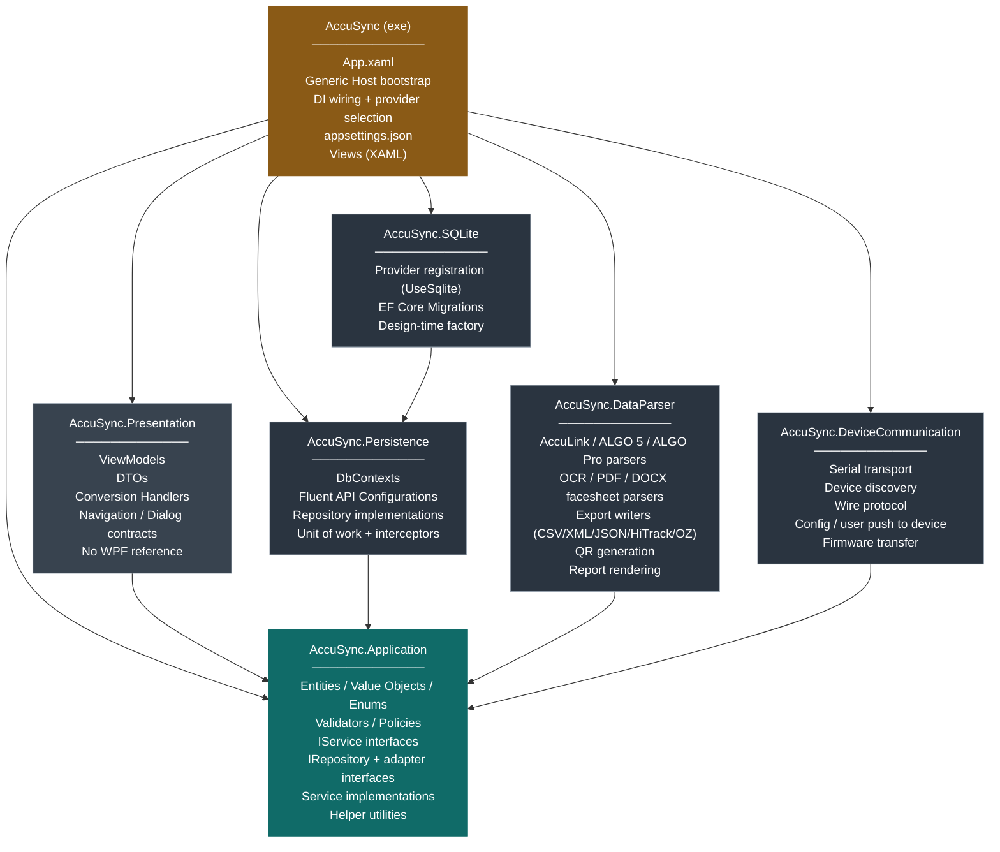
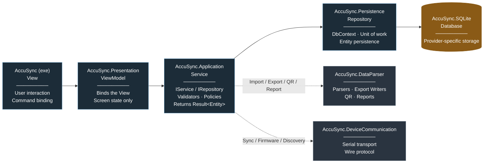

# AccuSync — Solution Architecture

## 1. Overview

AccuSync is structured as seven projects — one executable and six class libraries — organized around a single application core (`AccuSync.Application`) that holds the domain model and business logic. Presentation, persistence, file-format exchange, and device communication are each isolated into their own project and depend inward on the application core. The database provider is isolated behind a dedicated adapter project, allowing additional providers to be added without modifying existing code.

---

## 2. Solution Structure

| # | Project | Type | TFM | Responsibility |
|---|---|---|---|---|
| 1 | `AccuSync` | WPF Executable | `net10.0-windows` | Composition root and presentation shell. Hosts `App.xaml`, the .NET Generic Host bootstrap, dependency-injection wiring, and `appsettings.json`. Contains all XAML Views. **Selects the active database provider** — see §3, "Provider selection". The only project that references every other project in the solution. |
| 2 | `AccuSync.Presentation` | Class Library | `net10.0` | View-Models bound to the Views hosted in `AccuSync`. **Owns the DTOs and the conversion handlers** that map entities returned by `AccuSync.Application` into UI-bindable shapes — see §3, "DTO boundary". Contains the navigation and dialog contracts the View-Models depend on. Deliberately carries **no WPF reference**, so a View-Model cannot call `MessageBox.Show`, reach a control by name, or construct a `Window`. |
| 3 | `AccuSync.Application` | Class Library | `net10.0` | The application core. Contains domain entities, value objects, enums, validators and policies; `IService`, `IRepository` and adapter interface contracts; the service classes implementing use-case orchestration; and internal helper utilities. Zero dependencies on any other AccuSync project. |
| 4 | `AccuSync.Persistence` | Class Library | `net10.0` | Entity Framework Core data-access layer, **provider-agnostic**. Contains both `DbContext` classes, entity Fluent API configurations, every repository implementation, the unit of work, and the `SaveChanges` interceptors. References EF Core Relational only — no provider package. |
| 5 | `AccuSync.SQLite` | Class Library | `net10.0` | Concrete database-provider adapter for SQLite: provider registration, connection configuration, EF Core migrations, and design-time tooling support. Additional providers (SQL Server, PostgreSQL, …) are added as sibling projects following the same shape. **Migrations cannot be shared between providers** — the generated SQL is engine-specific — which is why each provider owns its own project. |
| 6 | `AccuSync.DataParser` | Class Library | `net10.0-windows` | File-format exchange. Import parsers for AccuLink XML, ALGO 5 XML, ALGO Pro JSON, and OCR/PDF/DOCX facesheet formats; export writers for CSV/XML/JSON/HiTrack/OZ formats; QR code generation; and printable report rendering. Windows-bound because OCR requires `System.Drawing.Common`. |
| 7 | `AccuSync.DeviceCommunication` | Class Library | `net10.0-windows` | Device I/O. Serial-port transport to AccuScreen / ALGO hardware, device discovery, the wire protocol, configuration and user/facility push-to-device, and firmware update transfer. Separate from `AccuSync.DataParser` because **parsing a file and talking to a device are different concerns with different failure modes** — a parser is a pure transformation over a stream, whereas device I/O is stateful, timing-sensitive, and can fail mid-conversation. |

---

## 3. Dependency Rules

| Project | References |
|---|---|
| `AccuSync.Application` | *(none)* |
| `AccuSync.Persistence` | `AccuSync.Application` |
| `AccuSync.SQLite` | `AccuSync.Persistence` |
| `AccuSync.DataParser` | `AccuSync.Application` |
| `AccuSync.DeviceCommunication` | `AccuSync.Application` |
| `AccuSync.Presentation` | `AccuSync.Application` |
| `AccuSync` (exe) | `AccuSync.Presentation`, `AccuSync.Application`, `AccuSync.Persistence`, `AccuSync.SQLite`, `AccuSync.DataParser`, `AccuSync.DeviceCommunication` |

All dependencies point inward, toward `AccuSync.Application`. `AccuSync.Persistence`, `AccuSync.DataParser` and `AccuSync.DeviceCommunication` do not reference each other. `AccuSync.SQLite` references only `AccuSync.Persistence`, which it extends with provider-specific configuration.

**Technology isolation.** `AccuSync.Application` carries no reference — direct or transitive — to Entity Framework Core or any other ORM/database package. It defines only the `IRepository` abstractions, using plain domain types and collections in every method signature (never `IQueryable<T>`, `DbSet<T>`, or any other EF Core–specific type). Every EF Core–specific type — `DbContext`, `DbSet<T>`, `IEntityTypeConfiguration<T>` — is confined to `AccuSync.Persistence` and its provider adapters. `AccuSync.Application` compiles and runs with no knowledge of which persistence technology, or which database provider, is in use.

**Interface ownership.** Every interface is owned by the layer that is *inner* to it, never by the layer that implements it. `AccuSync.Application` therefore declares both what it requires from the outside (`IRepository`, `IDataParser`, `IDeviceChannel`, `IClock`) and what it offers to the outside (`IService`). `AccuSync.Persistence`, `AccuSync.DataParser` and `AccuSync.DeviceCommunication` adapt to those contracts. The practical test: delete every project except `AccuSync.Application` and it must still compile.

**Provider selection.** Choosing between `AccuSync.SQLite` and any future provider happens in the executable's DI registration, because that is the only project that references the provider adapters. `AccuSync.Persistence` must not perform the selection — it does not, and must not, reference its own providers.

**DTO boundary.** `AccuSync.Application` returns **entities**; `AccuSync.Presentation` owns the DTOs and converts. That is structurally safe — Presentation already references Application — but entities are mutable and carry behaviour, so one rule comes with it:

> An entity may be **passed into** a conversion handler, but must never be stored on a View-Model property or bound to a View. Converters consume entities and return DTOs; the entity reference is discarded when the method returns. Every property the XAML binds to is a DTO or a primitive.

Without that rule a View-Model holding an entity could call its mutating methods directly, skipping the service's validation, and two-way binding would mutate it outside any use case — leaving a dirty object that an unrelated save would commit. This is the one place in the design where correctness depends on review rather than on the project graph, so it belongs on the code-review checklist. Note also that because `IService` signatures expose entity types, changing an entity is a breaking change for `AccuSync.Presentation`.

---

## 4. High-Level Design (HLD)

### 4.1 Dependency Diagram



### 4.2 Operation Flow (left to right)



---

## 5. Low-Level Design (LLD) — Project Structure

### `AccuSync` (Executable)
```
AccuSync/
├── App.xaml
├── App.xaml.cs
├── appsettings.json
├── Views/
│   ├── Login/
│   │   └── LoginView.xaml
│   ├── Dashboard/
│   │   └── DashboardView.xaml
│   ├── Patients/
│   │   ├── PatientListView.xaml
│   │   └── PatientDetailView.xaml
│   └── Shared/
│       ├── RibbonToolbar.xaml
│       └── SidebarNavigation.xaml
├── Services/                              WPF implementations of Presentation contracts
│   ├── WpfNavigationService.cs
│   ├── WpfDialogService.cs
│   └── WpfFilePickerService.cs
└── DependencyInjection/
    ├── ServiceRegistration.cs
    └── PersistenceProviderSelection.cs    reads Persistence:Provider, registers one adapter
```

### `AccuSync.Presentation`
```
AccuSync.Presentation/
├── ViewModels/
│   ├── LoginViewModel.cs
│   ├── DashboardViewModel.cs
│   ├── PatientListViewModel.cs
│   └── PatientDetailViewModel.cs
├── Dtos/                                  UI-bindable shapes — owned by Presentation
│   ├── PatientDto.cs
│   ├── PatientListItemDto.cs
│   └── UserDto.cs
├── Converters/                            entity → DTO mapping — see §3
│   ├── PatientConversionHandler.cs
│   └── UserConversionHandler.cs
├── Abstractions/                          contracts the exe implements
│   ├── INavigationService.cs
│   ├── IDialogService.cs
│   └── IFilePickerService.cs
└── Common/                                hand-written MVVM base — no third-party package (§7)
    ├── ObservableObject.cs                INotifyPropertyChanged + SetProperty helper
    ├── ViewModelBase.cs                   IsBusy · ErrorMessage · RunGuardedAsync
    ├── ValidatableViewModelBase.cs        INotifyDataErrorInfo
    ├── RelayCommand.cs                    ICommand, synchronous, optional parameter
    └── AsyncRelayCommand.cs               ICommand, async, re-entrancy guard
```

### `AccuSync.Application`
```
AccuSync.Application/
├── Entities/
│   ├── Patient.cs
│   ├── User.cs
│   └── TestRecord.cs
├── Enums/                                 fixed sets of named values — no data, no behaviour
│   ├── ScreeningResult.cs                 Pass | Refer | Incomplete
│   ├── TestType.cs                        ABR | TEOAE | DPOAE
│   ├── ConsentState.cs                    Full | Partial | None
│   ├── NicuStatus.cs
│   ├── ImportFormat.cs
│   └── ExportFormat.cs
├── ValueObjects/                          carry data AND validate themselves
│   ├── PhoneNumber.cs                     dial code + number + formatting
│   ├── SerialNumber.cs
│   ├── SiteCode.cs
│   └── Waveform.cs                        the 64-point A/B buffers
├── Validators/                            "is this input acceptable?"
│   ├── PatientValidator.cs
│   ├── SiteValidator.cs
│   └── PasswordComplexityValidator.cs
├── Policies/                              "what should the system decide?"
│   ├── LockoutPolicy.cs                   10 failures → 15-minute lock
│   └── PasswordExpiryPolicy.cs            90-day expiry
├── Abstractions/
│   ├── Services/
│   │   ├── IPatientService.cs
│   │   └── IUserService.cs
│   ├── Repositories/
│   │   ├── IPatientRepository.cs
│   │   ├── IUserRepository.cs
│   │   └── IUnitOfWork.cs
│   ├── Parsing/
│   │   ├── IDataParser.cs                 implemented by AccuSync.DataParser
│   │   ├── IExportWriter.cs
│   │   ├── IQrCodeGenerator.cs
│   │   └── IReportRenderer.cs
│   ├── Devices/
│   │   ├── IDeviceChannel.cs              implemented by AccuSync.DeviceCommunication
│   │   ├── IDeviceDiscovery.cs
│   │   └── IFirmwareUpdater.cs
│   └── System/
│       ├── IClock.cs
│       ├── IPasswordHasher.cs
│       ├── IFileSystem.cs
│       └── IAuditLogger.cs
├── Services/
│   ├── PatientService.cs
│   └── UserService.cs
├── Helpers/
│   ├── Result.cs
│   └── NameFormatter.cs
└── DependencyInjection/
    └── ApplicationServiceCollectionExtensions.cs
```

### `AccuSync.Persistence`
```
AccuSync.Persistence/
├── Contexts/
│   ├── PatientDbContext.cs
│   └── SettingsDbContext.cs
├── Configurations/
│   ├── PatientConfiguration.cs
│   └── UserConfiguration.cs
├── Repositories/
│   ├── PatientRepository.cs
│   └── UserRepository.cs
├── Interceptors/
│   └── TimestampInterceptor.cs            sets CreatedAt/ModifiedAt from IClock (§8)
├── UnitOfWork.cs
└── DependencyInjection/
    └── PersistenceServiceCollectionExtensions.cs   AddPersistenceCore() — engine-neutral only
```

### `AccuSync.SQLite`
```
AccuSync.SQLite/
├── Migrations/
│   └── 20260101_InitialCreate.cs
├── SqliteDesignTimeDbContextFactory.cs
└── DependencyInjection/
    └── SqliteServiceCollectionExtensions.cs        AddSqlitePersistence()
```

### `AccuSync.DataParser`
```
AccuSync.DataParser/
├── Import/
│   ├── AccuLinkXmlParser.cs
│   ├── Algo5XmlParser.cs
│   ├── AlgoProJsonParser.cs
│   ├── OcrFacesheetParser.cs
│   ├── PdfFacesheetParser.cs
│   └── DocxFacesheetParser.cs
├── Export/
│   ├── CsvExportWriter.cs
│   ├── HiTrackExportWriter.cs
│   └── OzExportWriter.cs
├── Reporting/
│   ├── QrCodeGenerator.cs
│   └── ReportRenderer.cs
└── DependencyInjection/
    └── DataParserServiceCollectionExtensions.cs
```

### `AccuSync.DeviceCommunication`
```
AccuSync.DeviceCommunication/
├── Transport/
│   ├── SerialPortDeviceChannel.cs         wraps System.IO.Ports
│   └── SerialPortDiscovery.cs
├── Protocol/
│   ├── DeviceFrame.cs                     wire framing
│   ├── DeviceCommand.cs
│   └── DeviceResponseReader.cs
├── Sync/
│   ├── ConfigurationPushService.cs        CopyToDevice for users / facilities
│   └── DeviceIdentityReader.cs            serial, hardware + firmware version
├── Firmware/
│   └── FirmwareUpdater.cs
└── DependencyInjection/
    └── DeviceCommunicationServiceCollectionExtensions.cs
```

---

## 6. Extensibility

Additional database providers are added as new sibling class libraries following the pattern established by `AccuSync.SQLite`, referencing only `AccuSync.Persistence`, and registered by one additional branch in the executable's provider selection. Additional file formats are added as new `IDataParser` / `IExportWriter` implementations inside `AccuSync.DataParser`; because the format is resolved from a registry rather than a `switch`, no existing file is modified. Additional device families are added as new `IDeviceChannel` implementations inside `AccuSync.DeviceCommunication`.

---

## 7. Target Framework — .NET 10

| Item | Value |
|---|---|
| Class libraries | `net10.0` |
| Executable, `AccuSync.DataParser`, `AccuSync.DeviceCommunication` | `net10.0-windows` |
| Language version | C# 14 |
| EF Core | 10.0.x (`Microsoft.EntityFrameworkCore`, `.Relational`, `.Sqlite`, `.Design`) |
| Hosting / DI | `Microsoft.Extensions.*` 10.0.x |
| MVVM | **No package.** Hand-written `ObservableObject`, `RelayCommand`, `AsyncRelayCommand` in `AccuSync.Presentation/Common/` (§5) |
| Support | .NET 10 is the current LTS release |

**Why three projects are `-windows`:** the executable uses WPF; `AccuSync.DataParser` needs `System.Drawing.Common` for OCR image handling, which has been Windows-only since .NET 7; `AccuSync.DeviceCommunication` uses `System.IO.Ports` against Windows COM ports. Everything else stays platform-neutral `net10.0`, which keeps `AccuSync.Application` and `AccuSync.Persistence` buildable and verifiable on any agent.

---

## 8. Code-First Approach and Migration Strategy

**The schema is defined by the C# model and generated from it.** Nothing creates or alters a table by hand, so there is only one definition of the schema and it cannot drift. Today it already has: the `.sql` files and `DatabaseService.cs` describe two different `Users` tables.

**Every schema change is a named, versioned, reviewed artefact.** It is committed with the code that needs it, reviewed before merge, and traceable to the release that shipped it. Under IEC 62304 a schema change is a design change; this puts it on the record rather than in someone's memory.

**The application upgrades its own database.** On launch it brings the database up to the version the software expects. A new installation and an upgrade from any earlier release both work with nothing for the user or hospital IT to run. The database file is copied first and restored if the upgrade fails, so a customer is never left with a half-changed database.

**Upgrades go forward only.** Reverting a customer's database means restoring that copy and reinstalling the previous version — which makes the backup part of the design rather than an optional extra.

**Configuration defaults survive upgrades.** The values AccuSync ships with — system settings, field labels, risk factors, predefined comments — are written only where absent. Anything an administrator has since changed is left untouched.
