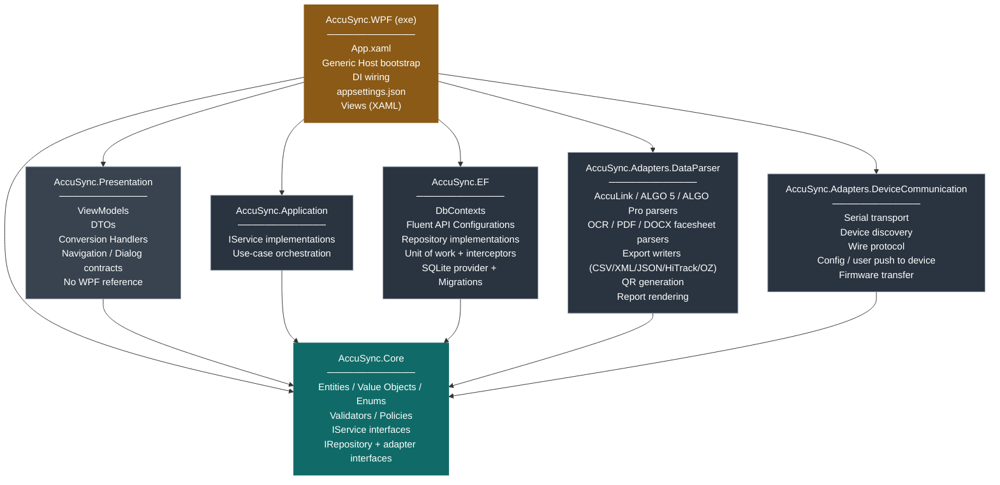
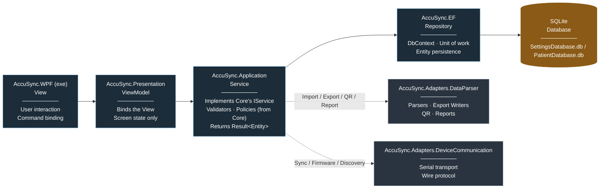

# AccuSync — Solution Architecture

## 1. Overview

AccuSync is structured as seven projects — one executable and six class libraries — organized around a domain core (`AccuSync.Core`) that holds the domain model and every abstraction (repository, service, parsing, device, and system interfaces) the rest of the solution depends on. `AccuSync.Application` implements use-case orchestration against those abstractions. Presentation, EF Core persistence, file-format exchange, and device communication are each isolated into their own project and depend inward on `AccuSync.Core`. Persistence is a single EF Core project — SQLite is the only database engine AccuSync targets, so the `DbContext`, provider registration, and migrations live together rather than behind a separate swap-in provider adapter.

---

## 2. Solution Structure

| # | Project | Type | TFM | Responsibility |
|---|---|---|---|---|
| 1 | `AccuSync.WPF` | WPF Executable | `net10.0-windows` | Composition root and presentation shell. Hosts `App.xaml`, the .NET Generic Host bootstrap, dependency-injection wiring, and `appsettings.json`. Contains all XAML Views. The only project that references every other project in the solution. |
| 2 | `AccuSync.Presentation` | Class Library | `net10.0` | View-Models bound to the Views hosted in `AccuSync.WPF`. **Owns the DTOs and the conversion handlers** that map entities returned through `AccuSync.Core`'s service interfaces into UI-bindable shapes — see §3, "DTO boundary". Contains the navigation and dialog contracts the View-Models depend on. Deliberately carries **no WPF reference**, so a View-Model cannot call `MessageBox.Show`, reach a control by name, or construct a `Window`. |
| 3 | `AccuSync.Core` | Class Library | `net10.0` | The domain core. Contains domain entities, value objects, enums, validators and policies; and **every abstraction the rest of the solution depends on** — `IService` and `IRepository` interfaces, and the adapter contracts (`IDataParser`, `IDeviceChannel`, ...). Zero dependencies on any other AccuSync project, and zero dependency on EF Core, WPF, or any technology package. |
| 4 | `AccuSync.Application` | Class Library | `net10.0` | Use-case orchestration. Contains the concrete `IService` implementations (`PatientService`, `UserService`, ...) that coordinate repositories, validators, and policies declared in `AccuSync.Core` to satisfy a use case. References `AccuSync.Core` only — never EF Core, SQLite, or any adapter package directly. |
| 5 | `AccuSync.EF` | Class Library | `net10.0` | Entity Framework Core data-access layer. SQLite is AccuSync's only provider, so the `DbContext` classes, entity Fluent API configurations, every repository implementation, the unit of work, `SaveChanges` interceptors, EF Core migrations, SQLite provider registration, and the design-time factory all live in **one** project rather than split behind a swappable adapter. References `AccuSync.Core` only. |
| 6 | `AccuSync.Adapters.DataParser` | Class Library | `net10.0-windows` | File-format exchange. Import parsers for AccuLink XML, ALGO 5 XML, ALGO Pro JSON, and OCR/PDF/DOCX facesheet formats; export writers for CSV/XML/JSON/HiTrack/OZ formats; QR code generation; and printable report rendering. Windows-bound because OCR requires `System.Drawing.Common`. |
| 7 | `AccuSync.Adapters.DeviceCommunication` | Class Library | `net10.0-windows` | Device I/O. Serial-port transport to AccuScreen / ALGO hardware, device discovery, the wire protocol, configuration and user/facility push-to-device, and firmware update transfer. Separate from `AccuSync.Adapters.DataParser` because **parsing a file and talking to a device are different concerns with different failure modes** — a parser is a pure transformation over a stream, whereas device I/O is stateful, timing-sensitive, and can fail mid-conversation. |

---

## 3. Dependency Rules

| Project | References |
|---|---|
| `AccuSync.Core` | *(none)* |
| `AccuSync.Application` | `AccuSync.Core` |
| `AccuSync.EF` | `AccuSync.Core` |
| `AccuSync.Adapters.DataParser` | `AccuSync.Core` |
| `AccuSync.Adapters.DeviceCommunication` | `AccuSync.Core` |
| `AccuSync.Presentation` | `AccuSync.Core` |
| `AccuSync.WPF` (exe) | `AccuSync.Presentation`, `AccuSync.Core`, `AccuSync.Application`, `AccuSync.EF`, `AccuSync.Adapters.DataParser`, `AccuSync.Adapters.DeviceCommunication` |

All dependencies point inward, toward `AccuSync.Core`. `AccuSync.Application`, `AccuSync.EF`, `AccuSync.Adapters.DataParser`, and `AccuSync.Adapters.DeviceCommunication` reference only `AccuSync.Core` and do not reference each other. `AccuSync.Presentation` references `AccuSync.Core` directly, not `AccuSync.Application` — since the interfaces a View-Model calls (`IPatientService`, `IUserService`) now live in `Core` rather than bundled together with their implementations, Presentation never needs to see a concrete service implementation, only the exe's composition root does.

**Technology isolation.** `AccuSync.Core` carries no reference — direct or transitive — to Entity Framework Core, WPF, or any other ORM/UI/I-O package. It defines only the `IRepository`/`IService`/adapter abstractions, using plain domain types and collections in every method signature (never `IQueryable<T>`, `DbSet<T>`, or any other EF Core–specific type). `AccuSync.Application` inherits the same restriction — it orchestrates purely through `AccuSync.Core`'s interfaces and never references EF Core or SQLite directly. Every EF Core–specific type — `DbContext`, `DbSet<T>`, `IEntityTypeConfiguration<T>` — is confined to `AccuSync.EF`. `AccuSync.Core` and `AccuSync.Application` compile and run with no knowledge of which persistence technology is in use.

**Interface ownership.** Every interface is owned by the innermost layer. `AccuSync.Core` declares both what it requires from the outside (`IRepository`, `IDataParser`, `IDeviceChannel`) and what it offers to the outside (`IService`). `AccuSync.Application`, `AccuSync.EF`, `AccuSync.Adapters.DataParser`, and `AccuSync.Adapters.DeviceCommunication` all adapt to contracts declared in `AccuSync.Core` — none of them declare public interfaces that other projects depend on. The practical test: delete every project except `AccuSync.Core` and it must still compile.

**Persistence technology.** `AccuSync.EF` is SQLite-only by design — the connection string, the `UseSqlite(...)` call, and migrations all live together in one project rather than behind a separate swap-in adapter, since AccuSync only ever targets one database engine and EF Core's own provider abstraction already makes swapping a one-line, one-package change. If a second provider is ever genuinely required, `AccuSync.EF`'s provider-specific pieces (the `UseSqlite` call, the `Migrations/` folder, the provider package reference) are the only things that would need to change or split back out — `AccuSync.Core` and `AccuSync.Application` are unaffected either way, since neither references EF Core.

**DTO boundary.** `AccuSync.Core`'s `IService` interfaces return **entities**; `AccuSync.Presentation` owns the DTOs and converts. That is structurally safe — Presentation already references Core — but entities are mutable and carry behaviour, so one rule comes with it:

> An entity may be **passed into** a conversion handler, but must never be stored on a View-Model property or bound to a View. Converters consume entities and return DTOs; the entity reference is discarded when the method returns. Every property the XAML binds to is a DTO or a primitive.

Without that rule a View-Model holding an entity could call its mutating methods directly, skipping the service's validation, and two-way binding would mutate it outside any use case — leaving a dirty object that an unrelated save would commit. This is the one place in the design where correctness depends on review rather than on the project graph, so it belongs on the code-review checklist. Note also that because `IService` signatures expose entity types, changing an entity is a breaking change for `AccuSync.Presentation`.

---

## 4. High-Level Design (HLD)

### 4.1 Dependency Diagram



### 4.2 Operation Flow (left to right)



---

## 5. Low-Level Design (LLD) — Project Structure

### `AccuSync.WPF` (Executable)
```
AccuSync.WPF/
├── App.xaml
├── App.xaml.cs
├── appsettings.json
├── Views/
│   ├── Login/
│   │   └── LoginView.xaml
│   ├── Dashboard/
│   │   └── DashboardView.xaml
│   ├── Patients/
│   │   ├── PatientListView.xaml
│   │   └── PatientDetailView.xaml
│   └── Shared/
│       ├── RibbonToolbar.xaml
│       └── SidebarNavigation.xaml
├── Services/                              WPF implementations of Presentation contracts
│   ├── WpfNavigationService.cs
│   ├── WpfDialogService.cs
│   └── WpfFilePickerService.cs
└── DependencyInjection/
    └── ServiceRegistration.cs             wires Core/Application/EF/Adapters in one place
```

### `AccuSync.Presentation`
```
AccuSync.Presentation/
├── ViewModels/
│   ├── LoginViewModel.cs
│   ├── DashboardViewModel.cs
│   ├── PatientListViewModel.cs
│   └── PatientDetailViewModel.cs
├── Dtos/                                  UI-bindable shapes — owned by Presentation
│   ├── PatientDto.cs
│   ├── PatientListItemDto.cs
│   └── UserDto.cs
├── Converters/                            entity → DTO mapping — see §3
│   ├── PatientConversionHandler.cs
│   └── UserConversionHandler.cs
├── Abstractions/                          contracts the exe implements
│   ├── INavigationService.cs
│   ├── IDialogService.cs
│   └── IFilePickerService.cs
└── Common/                                hand-written MVVM base — no third-party package (§7)
    ├── ObservableObject.cs                INotifyPropertyChanged + SetProperty helper
    ├── ViewModelBase.cs                   IsBusy · ErrorMessage · RunGuardedAsync
    ├── ValidatableViewModelBase.cs        INotifyDataErrorInfo
    ├── RelayCommand.cs                    ICommand, synchronous, optional parameter
    └── AsyncRelayCommand.cs               ICommand, async, re-entrancy guard
```

### `AccuSync.Core`
```
AccuSync.Core/
├── Entities/
│   ├── Patient.cs
│   ├── User.cs
│   └── TestRecord.cs
├── Enums/                                 fixed sets of named values — no data, no behaviour
│   ├── ScreeningResult.cs                 Pass | Refer | Incomplete
│   ├── TestType.cs                        ABR | TEOAE | DPOAE
│   ├── ConsentState.cs                    Full | Partial | None
│   ├── NicuStatus.cs
│   ├── ImportFormat.cs
│   └── ExportFormat.cs
├── ValueObjects/                          carry data AND validate themselves
│   ├── PhoneNumber.cs                     dial code + number + formatting
│   ├── SerialNumber.cs
│   ├── SiteCode.cs
│   └── Waveform.cs                        the 64-point A/B buffers
├── Validators/                            "is this input acceptable?"
│   ├── PatientValidator.cs
│   ├── SiteValidator.cs
│   └── PasswordComplexityValidator.cs
├── Policies/                              "what should the system decide?"
│   ├── LockoutPolicy.cs                   10 failures → 15-minute lock
│   └── PasswordExpiryPolicy.cs            90-day expiry
├── Abstractions/
│   ├── Services/
│   │   ├── IPatientService.cs
│   │   └── IUserService.cs
│   ├── Repositories/
│   │   ├── IPatientRepository.cs
│   │   └── IUserRepository.cs
│   ├── Parsing/
│   │   ├── IDataParser.cs                 implemented by AccuSync.Adapters.DataParser
│   │   ├── IExportWriter.cs
│   │   ├── IQrCodeGenerator.cs
│   │   └── IReportRenderer.cs
│   ├── Devices/
│   │   ├── IDeviceChannel.cs              implemented by AccuSync.Adapters.DeviceCommunication
│   │   ├── IDeviceDiscovery.cs
│   │   └── IFirmwareUpdater.cs
│   └── System/
│       ├── IPasswordHasher.cs
│       ├── IFileSystem.cs
│       └── IAuditLogger.cs
└── Helpers/
    ├── Result.cs
    └── NameFormatter.cs
```

### `AccuSync.Application`
```
AccuSync.Application/
├── Services/
│   ├── PatientService.cs                  implements Core.Abstractions.Services.IPatientService
│   └── UserService.cs
└── DependencyInjection/
    └── ApplicationServiceCollectionExtensions.cs
```

### `AccuSync.EF`
```
AccuSync.EF/
├── Contexts/
│   ├── PatientDbContext.cs
│   └── SettingsDbContext.cs
├── Configurations/
│   ├── PatientConfiguration.cs
│   └── UserConfiguration.cs
├── Repositories/
│   ├── PatientRepository.cs
│   └── UserRepository.cs
├── Interceptors/
│   └── TimestampInterceptor.cs            sets CreatedAt/ModifiedAt from DateTimeOffset.UtcNow
├── Migrations/
│   └── 20260101_InitialCreate.cs
├── SqliteDesignTimeDbContextFactory.cs
└── DependencyInjection/
    └── SqliteServiceCollectionExtensions.cs   AddSqlitePersistence() — UseSqlite, repositories, interceptors in one call
```

### `AccuSync.Adapters.DataParser`
```
AccuSync.Adapters.DataParser/
├── Import/
│   ├── AccuLinkXmlParser.cs
│   ├── Algo5XmlParser.cs
│   ├── AlgoProJsonParser.cs
│   ├── OcrFacesheetParser.cs
│   ├── PdfFacesheetParser.cs
│   └── DocxFacesheetParser.cs
├── Export/
│   ├── CsvExportWriter.cs
│   ├── HiTrackExportWriter.cs
│   └── OzExportWriter.cs
├── Reporting/
│   ├── QrCodeGenerator.cs
│   └── ReportRenderer.cs
└── DependencyInjection/
    └── DataParserServiceCollectionExtensions.cs
```

### `AccuSync.Adapters.DeviceCommunication`
```
AccuSync.Adapters.DeviceCommunication/
├── Transport/
│   ├── SerialPortDeviceChannel.cs         wraps System.IO.Ports
│   └── SerialPortDiscovery.cs
├── Protocol/
│   ├── DeviceFrame.cs                     wire framing
│   ├── DeviceCommand.cs
│   └── DeviceResponseReader.cs
├── Sync/
│   ├── ConfigurationPushService.cs        CopyToDevice for users / facilities
│   └── DeviceIdentityReader.cs            serial, hardware + firmware version
├── Firmware/
│   └── FirmwareUpdater.cs
└── DependencyInjection/
    └── DeviceCommunicationServiceCollectionExtensions.cs
```

---

## 6. Extensibility

Additional file formats are added as new `IDataParser` / `IExportWriter` implementations inside `AccuSync.Adapters.DataParser`; because the format is resolved from a registry rather than a `switch`, no existing file is modified. Additional device families are added as new `IDeviceChannel` implementations inside `AccuSync.Adapters.DeviceCommunication`. A second database provider, if ever genuinely required, is added inside `AccuSync.EF` itself (a new `UseXxx(...)` branch and its own `Migrations/` subfolder) — `AccuSync.Core` and `AccuSync.Application` need no changes either way, since neither references EF Core.

---

## 7. Target Framework — .NET 10

| Item | Value |
|---|---|
| Class libraries | `net10.0` |
| Executable, `AccuSync.Adapters.DataParser`, `AccuSync.Adapters.DeviceCommunication` | `net10.0-windows` |
| Language version | C# 14 |
| EF Core | 10.0.x (`Microsoft.EntityFrameworkCore`, `.Relational`, `.Sqlite`, `.Design`) |
| Hosting / DI | `Microsoft.Extensions.*` 10.0.x |
| MVVM | **No package.** Hand-written `ObservableObject`, `RelayCommand`, `AsyncRelayCommand` in `AccuSync.Presentation/Common/` (§5) |
| Support | .NET 10 is the current LTS release |

**Why three projects are `-windows`:** the executable uses WPF; `AccuSync.Adapters.DataParser` needs `System.Drawing.Common` for OCR image handling, which has been Windows-only since .NET 7; `AccuSync.Adapters.DeviceCommunication` uses `System.IO.Ports` against Windows COM ports. Everything else stays platform-neutral `net10.0`, which keeps `AccuSync.Core`, `AccuSync.Application`, and `AccuSync.EF` buildable and verifiable on any agent.

---

## 8. Code-First Approach and Migration Strategy

**The schema is defined by the C# model and generated from it.** Nothing creates or alters a table by hand, so there is only one definition of the schema and it cannot drift. Today it already has: the `.sql` files and `DatabaseService.cs` describe two different `Users` tables.

**Every schema change is a named, versioned, reviewed artefact.** It is committed with the code that needs it, reviewed before merge, and traceable to the release that shipped it. Under IEC 62304 a schema change is a design change; this puts it on the record rather than in someone's memory.

**The application upgrades its own database.** On launch it brings the database up to the version the software expects. A new installation and an upgrade from any earlier release both work with nothing for the user or hospital IT to run. The database file is copied first and restored if the upgrade fails, so a customer is never left with a half-changed database.

**Upgrades go forward only.** Reverting a customer's database means restoring that copy and reinstalling the previous version — which makes the backup part of the design rather than an optional extra.

**Configuration defaults survive upgrades.** The values AccuSync ships with — system settings, field labels, risk factors, predefined comments — are written only where absent. Anything an administrator has since changed is left untouched.
