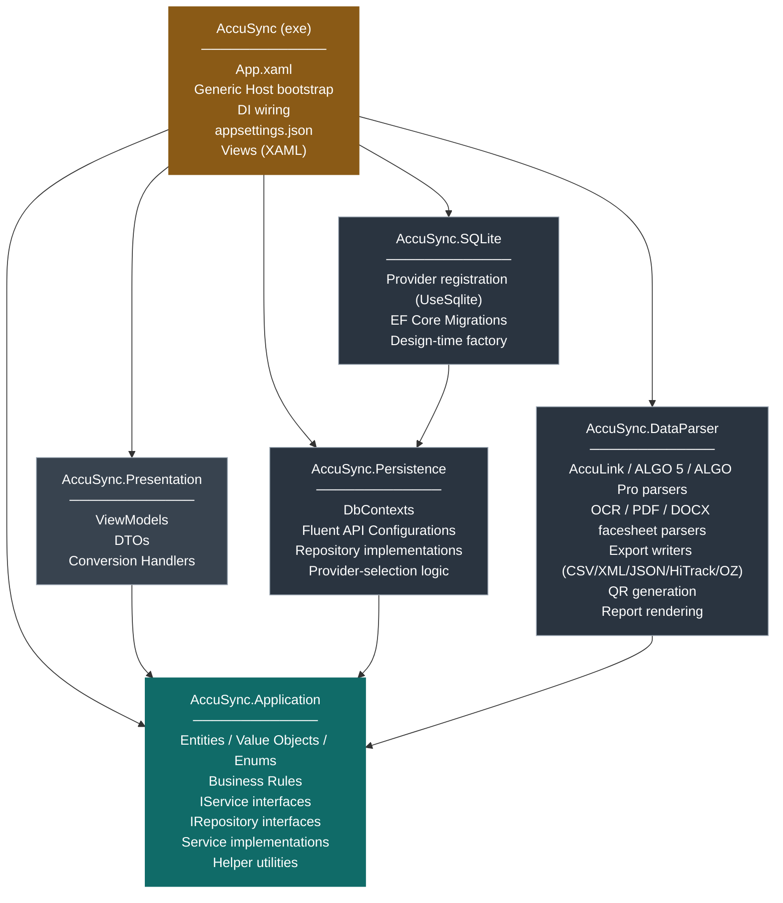
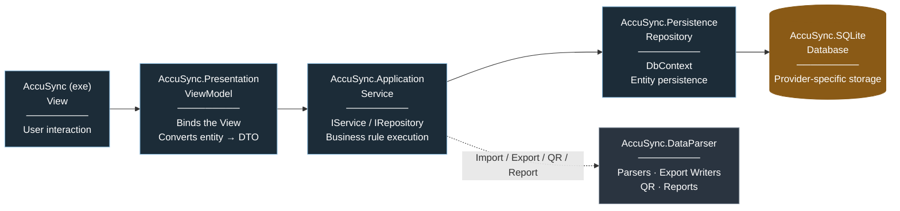

# AccuSync — Solution Architecture

**Version:** 1.0
**Platform:** WPF (.NET 10), MVVM presentation pattern, Entity Framework Core persistence
**Scope:** Multi-project solution structure for the AccuSync rebuild

---

## 1. Overview

AccuSync is structured as six+ projects — one executable and five class libraries — organized around a single application core (`AccuSync.Application`) that holds the domain model and business logic. Presentation, persistence, and external data exchange are each isolated into their own project and depend inward on the application core. The database provider is isolated behind a dedicated adapter project, allowing additional providers to be added without modifying existing code.

---

## 2. Solution Structure

| # | Project | Type | Responsibility |
|---|---|---|---|
| 1 | `AccuSync` | WPF Executable | Composition root and presentation shell. Hosts `App.xaml`, the .NET Generic Host bootstrap, dependency-injection wiring, and `appsettings.json`. Contains all XAML Views. The only project that references every other project in the solution. |
| 2 | `AccuSync.Presentation` | Class Library | View-Models bound to the Views hosted in `AccuSync`. Defines its own DTOs and conversion handlers, which map the entities and results returned by `AccuSync.Application` into UI-bindable shapes. |
| 3 | `AccuSync.Application` | Class Library | The application core. Contains domain entities, value objects, enums, and business rules; `IService` and `IRepository` interface contracts; the service classes implementing use-case orchestration; and internal helper utilities (formatting, validation, result wrapping). Zero dependencies on any other AccuSync project. |
| 4 | `AccuSync.Persistence` | Class Library | Entity Framework Core data-access layer, provider-agnostic. Contains both `DbContext` classes, entity Fluent API configurations, every repository implementation, and the provider-selection logic that reads the active database provider from configuration. |
| 5 | `AccuSync.SQLite` | Class Library | Concrete database-provider adapter for SQLite: provider registration, connection configuration, EF Core migrations, and design-time tooling support. Additional providers (SQL Server, PostgreSQL, …) are added as sibling projects following the same shape. |
| 6 | `AccuSync.DataParser` | Class Library | External data exchange. Import parsers for AccuLink XML, ALGO 5 XML, ALGO Pro JSON, and OCR/PDF/DOCX facesheet formats; export writers for CSV/XML/JSON/HiTrack/OZ formats; QR code generation; and printable report rendering. |

---

## 3. Dependency Rules

| Project | References |
|---|---|
| `AccuSync.Application` | *(none)* |
| `AccuSync.Persistence` | `AccuSync.Application` |
| `AccuSync.SQLite` | `AccuSync.Persistence` |
| `AccuSync.DataParser` | `AccuSync.Application` |
| `AccuSync.Presentation` | `AccuSync.Application` |
| `AccuSync` (exe) | `AccuSync.Presentation`, `AccuSync.Application`, `AccuSync.Persistence`, `AccuSync.SQLite`, `AccuSync.DataParser` |

All dependencies point inward, toward `AccuSync.Application`. `AccuSync.Persistence` and `AccuSync.DataParser` do not reference each other. `AccuSync.SQLite` references only `AccuSync.Persistence`, which it extends with provider-specific configuration.

**Technology isolation.** `AccuSync.Application` carries no reference — direct or transitive — to Entity Framework Core or any other ORM/database package. It defines only the `IRepository` abstractions, using plain domain types and collections in every method signature (never `IQueryable<T>`, `DbSet<T>`, or any other EF Core–specific type). Every EF Core–specific type — `DbContext`, `DbSet<T>`, `IEntityTypeConfiguration<T>` — is confined to `AccuSync.Persistence` and its provider adapters. `AccuSync.Application` compiles and runs with no knowledge of which persistence technology, or which database provider, is in use.

---

## 4. High-Level Design (HLD)

### 4.1 Dependency Diagram



### 4.2 Operation Flow (left to right)



---

## 5. Low-Level Design (LLD) — Project Structure

### `AccuSync` (Executable)
```
AccuSync/
├── App.xaml
├── App.xaml.cs
├── appsettings.json
├── Views/
│   ├── Login/
│   │   └── LoginView.xaml
│   ├── Dashboard/
│   │   └── DashboardView.xaml
│   ├── Patients/
│   │   ├── PatientListView.xaml
│   │   └── PatientDetailView.xaml
│   └── Shared/
│       ├── RibbonToolbar.xaml
│       └── SidebarNavigation.xaml
└── DependencyInjection/
    └── ServiceRegistration.cs
```

### `AccuSync.Presentation`
```
AccuSync.Presentation/
├── ViewModels/
│   ├── LoginViewModel.cs
│   ├── DashboardViewModel.cs
│   ├── PatientListViewModel.cs
│   └── PatientDetailViewModel.cs
├── Dtos/
│   ├── PatientDto.cs
│   └── UserDto.cs
└── Converters/
    └── PatientConversionHandler.cs
```

### `AccuSync.Application`
```
AccuSync.Application/
├── Entities/
│   ├── Patient.cs
│   ├── User.cs
│   └── TestRecord.cs
├── ValueObjects/
│   ├── ScreeningResult.cs
│   └── PhoneNumber.cs
├── Rules/
│   ├── LockoutPolicy.cs
│   └── PasswordPolicyEvaluator.cs
├── Abstractions/
│   ├── Services/
│   │   ├── IPatientService.cs
│   │   └── IUserService.cs
│   └── Repositories/
│       ├── IPatientRepository.cs
│       └── IUserRepository.cs
├── Services/
│   ├── PatientService.cs
│   └── UserService.cs
├── Helpers/
│   ├── Result.cs
│   ├── NameFormatter.cs
│   └── PasswordHasher.cs
└── DependencyInjection/
    └── ApplicationServiceCollectionExtensions.cs
```

### `AccuSync.Persistence`
```
AccuSync.Persistence/
├── Contexts/
│   ├── PatientDbContext.cs
│   └── SettingsDbContext.cs
├── Configurations/
│   ├── PatientConfiguration.cs
│   └── UserConfiguration.cs
├── Repositories/
│   ├── PatientRepository.cs
│   └── UserRepository.cs
├── UnitOfWork.cs
└── DependencyInjection/
    └── PersistenceServiceCollectionExtensions.cs
```

### `AccuSync.SQLite`
```
AccuSync.SQLite/
├── Migrations/
│   └── 20260101_InitialCreate.cs
├── SqliteDesignTimeDbContextFactory.cs
└── DependencyInjection/
    └── SqliteServiceCollectionExtensions.cs
```

### `AccuSync.DataParser`
```
AccuSync.DataParser/
├── Import/
│   ├── AccuLinkXmlParser.cs
│   ├── Algo5XmlParser.cs
│   ├── AlgoProJsonParser.cs
│   ├── OcrFacesheetParser.cs
│   ├── PdfFacesheetParser.cs
│   └── DocxFacesheetParser.cs
├── Export/
│   ├── CsvExportWriter.cs
│   ├── HiTrackExportWriter.cs
│   └── OzExportWriter.cs
├── Reporting/
│   ├── QrCodeGenerator.cs
│   └── ReportRenderer.cs
└── DependencyInjection/
    └── DataParserServiceCollectionExtensions.cs
```

---

## 6. Extensibility

Additional database providers are added as new sibling class libraries following the pattern established by `AccuSync.SQLite`, referencing only `AccuSync.Persistence`. Additional external formats or output channels are added within `AccuSync.DataParser`, or as a new sibling project following the same pattern, without modifying existing projects.
